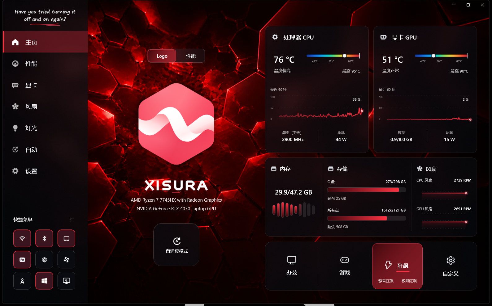
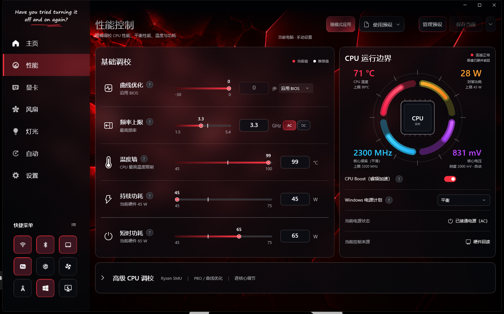
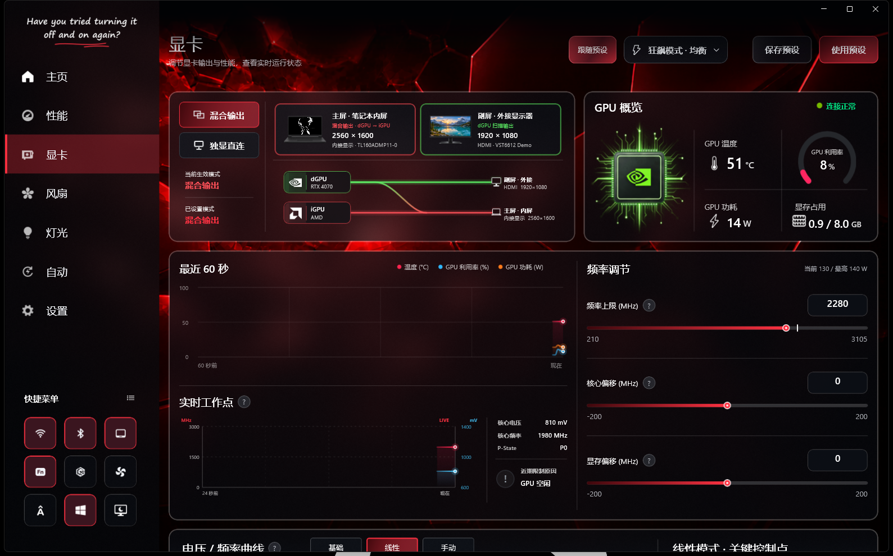
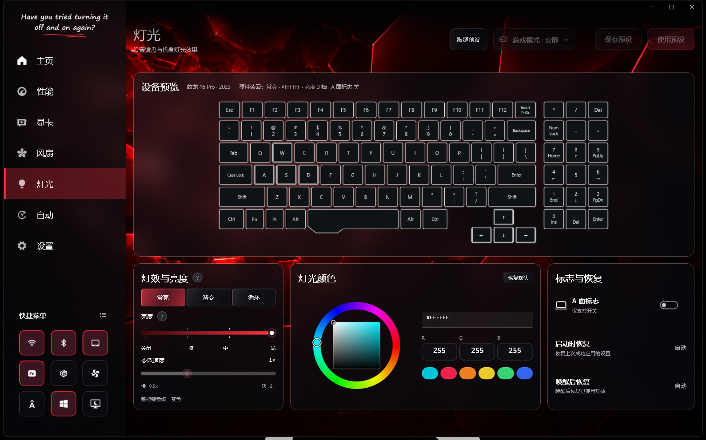
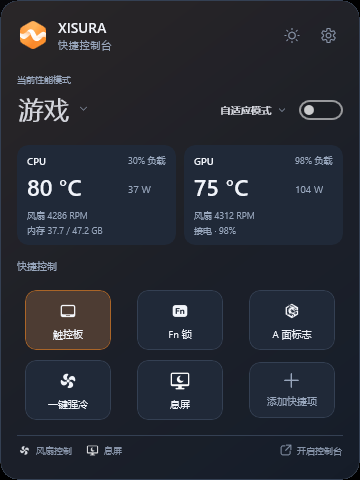

# XISURA

**蛟龙 16 Pro 2023 款控制台** · Windows 11 原生桌面应用

XISURA 将性能模式、CPU 与 GPU 调校、风扇、灯光和实时监测集中在同一套界面中，并提供常驻托盘的快捷控制台。主要适配对象是搭载 **AMD Ryzen 7 7745HX + NVIDIA GeForce RTX 4070 Laptop GPU** 的蛟龙 16 Pro 2023 款。

这是独立开发的设备控制项目，**不是机械革命官方软件，也不代表硬件厂商提供兼容性承诺**。仓库、界面与项目标识使用 XISURA；部分程序集、服务及安装包仍保留 `Jiaolong` 内部名称，以维持已有安装与配置的兼容性。

安装包见 [Releases](https://github.com/1145911974/XISURA/releases)。当前版本 **1.0.67**，适用于 Windows 11 x64。

## 界面预览

以下图片来自 XISURA 1.0.65 实际运行窗口，包含完整侧边栏与页面内容；点击图片可查看原尺寸。

### 首页



模式切换、探索模式 Logo、CPU/GPU 监测与快捷入口集中在首页。

### 性能控制



编辑模式预设，设置频率、温度和功耗；右侧同步显示处理器实际运行状态。

### 显卡



展示内屏混合输出与外屏独显直连路径，同时查看显卡监测、频率调节与偏移控制。

### 灯光



键盘预览与灯效、亮度、颜色和 A 面标识控制位于同一页面。

### 快捷控制台



在紧凑窗口中切换模式与自适应策略，查看温度、风扇状态并使用快捷操作。

## 主要功能

| 模块 | 用途 |
| --- | --- |
| 首页 | 查看 CPU、GPU 状态，切换原生性能模式，进入自适应调度与常用控制。 |
| 性能 | 调整处理器温度限制、持续/短时功耗、频率上限及 Boost；管理当前模式的性能预设。 |
| 显卡 | 查看 GPU 温度、负载、频率等信息；在设备支持时调整 GPU 参数及频率上限。 |
| 显示连接 | 区分混合输出和独显直连，显示 GPU 到屏幕的连接路径与当前设备信息。 |
| 风扇 | 使用设备支持的自动控制、转速上限、曲线或强冷功能；具体入口取决于能力探测结果。 |
| 灯光 | 调整受支持的键盘灯效、颜色、亮度和效果参数，独立决定是否跟随预设。 |
| 自适应 | 提供安静优先、均衡自适应、响应优先策略，根据运行状态进行调度。 |
| 快捷控制台 | 从托盘快速查看状态、切换模式和预设，以及操作已配置的快捷项。 |
| 外观 | 深浅主题、探索/经典标识；探索标识和运行中的任务栏、托盘图标随模式呈现对应状态。 |

硬件能力由服务读取。设备不支持、依赖缺失或尚未完成确认时，相应功能可能不可用；界面可见不等于硬件已成功接受修改。

## 模式与预设怎么用

### 六个模式，每个三个预设

预设按 **办公、游戏、狂飙、自定义 1、自定义 2、自定义 3** 组织，每个模式提供三个可命名的槽位，默认名称为安静、均衡、性能。自定义模式是应用中的配置分组，不代表固件新增了三个原生硬件模式。

- **选择预设**：选择要查看或编辑的配置。
- **保存预设**：保存当前编辑内容；保存与实际应用是不同操作。
- **使用预设**：提交配置并等待硬件确认。
- **恢复默认**：将当前槽位恢复为项目提供的默认推荐配置，不影响其他槽位。
- **正在编辑**：当前编辑器选中的配置。
- **正在使用**：已完成应用并具有有效确认记录的配置；设备状态变化后，该标记可能被清除。
- **已记忆**：快捷控制台中记住的模式预设，不等于它正在生效。

选择原生办公、游戏、狂飙模式时，应用先切换并确认硬件模式，再处理需要跟随的配置。后续预设失败应显示实际结果，不能把失败伪装成成功，也不能仅凭选中颜色判断生效。

### 每个页面独立「跟随预设」

性能、显卡、风扇和灯光分别保存自己的开关状态，互不代替。

| 状态 | 页面行为 |
| --- | --- |
| 开启 | 编辑、保存和使用该页面的预设；模式切换时按该页面的跟随设置处理配置。 |
| 关闭 | 查看和调整当前设置；预设选择、保存、使用及恢复默认入口停用，已有保存配置保留。 |

例如，可以让 CPU 跟随办公/游戏预设，同时让灯光保持当前颜色。关闭跟随不会删除配置；重新开启后仍可继续使用已保存的预设。

草稿与实际读回分别保留，切换开关不会把草稿误当成设备设置。未能读回的 GPU 频率上限、固件风扇曲线会显示未知或说明，而不会填入推荐值冒充实际值。灯光页的 A 面标识开关始终直接控制设备，键盘灯效参与灯光预设。

操作提示出现时，「跟随预设」与预设选择器一起左移让出位置；普通提示约两秒后淡出，控件平滑归位。保存与使用按钮保持固定；正在提交的提示持续到操作完成。长提示可悬停查看完整内容。

### 重复启动

同一用户再次启动已安装的 XISURA，会唤醒原窗口并保留所在页面；隐藏或最小化窗口会恢复。重复启动不会创建另一套控制窗口或重复硬件控制会话。

### 狂飙的三个分支

**普通狂飙**与其他模式一样，使用所选预设。**静音狂飙**和**极限狂飙**使用内置策略，普通预设不能在分支运行时覆盖它们；保存和恢复预设配置仍可进行。

当前内置目标如下，后续版本可能根据实测调整：

| 项目 | 静音狂飙 | 极限狂飙 |
| --- | --- | --- |
| CPU 温度上限 | 80°C | 95°C |
| 持续 / 短时功耗目标 | 45 / 45 W | 75 / 75 W |
| 接电频率上限 | 4500 MHz | 5100 MHz |
| 电池频率上限 | 3300 MHz | 3300 MHz |
| Boost | 开启 | 开启 |
| 风扇 | 设备自动控制，3500 RPM 上限策略；保留温度保护接管 | 支持时启用强冷 |
| GPU | 支持时设置 2100 MHz 频率上限，并受设备报告范围约束 | 支持时释放软件频率上限 |

这些是控制目标，并非对实际频率、温度、帧率或噪声的保证。静音分支侧重降低功耗与噪声；极限分支侧重释放受支持的性能与散热能力，并不绕过固件保护。

退出分支时，应用恢复仍由该分支持有的风扇/GPU 设置；用户期间手动改动的值不应被旧快照覆盖。该机制不包含 GPU 功耗解锁、修改 MUX 或自动写入 CO/PBO。

## 显示输出

- **混合输出**：`dGPU → iGPU → 显示器`，独显渲染后通过核显输出。
- **独显直连**：`dGPU → 显示器`。

实际路径仍取决于内屏、接口布线、显卡驱动和固件支持。设置的 MUX 模式与当前生效模式分别确认；需要重启的切换，必须在重启后才能确认最终路径。

**三屏、四屏连接尚未完成对应数量实体显示器的完整验证。** 不应将路径绘制或模拟结果视为多屏实机兼容性保证。

## 安装与首次运行

运行环境为 **Windows 11 x64**。安装程序会部署桌面客户端及本地硬件服务，因此安装、升级和卸载可能需要管理员权限。

1. 从本仓库发布者提供的安装包安装；私有仓库内容需要相应访问权限。
2. 启动 XISURA，等待本地服务连接及硬件能力识别完成。
3. 确认读取到的机型、CPU、GPU 和当前模式符合实际设备。
4. 首次调校从默认推荐配置开始；先完成一次应用和读回确认，再继续修改。
5. 进行需要接电的功耗/温度调整时接通电源。被温度或能力检查拒绝时，查看具体原因后再处理。

安装包负责注册 `JiaolongControlService`。只复制客户端程序不能替代服务安装。部分底层功能还依赖设备可用的硬件接口与兼容依赖；不要为了点亮不可用按钮而安装来源不明的驱动。

如果其他控制软件同时写入相同的模式、风扇或功耗设置，可能发生相互覆盖。排查状态反复变化时，应先确认是否存在其他控制来源。

## 安全与状态确认

应用使用「提交 → 读回 → 确认」的控制流程。组合修改会校验参数范围、设备能力、接电状态及相关温度条件，并在失败时尝试回滚。回滚是否成功也必须如实反映；不要仅凭动画或选中状态推断硬件成功。

- 高温下增加功耗和降低/保持现有限制不是同一种操作，检查会区分方向。
- 当前限制值可能来自固件原生档位；它们不一定等于用户界面允许手动写入的范围。
- 固件、驱动及温度保护仍可限制最终效果。
- 不支持的功能应保持不可用，不能通过模拟数值宣称已经控制硬件。
- 本项目的兼容性范围围绕上述机型建立；其他 CPU、GPU、主板或 BIOS 组合需要独立验证。

## 从源码构建

以下为仓库当前项目配置，升级依赖时以实际文件为准：

| 组件 | 当前配置 |
| --- | --- |
| .NET SDK | `10.0.302`，见 [`global.json`](global.json) |
| 客户端目标框架 | `net10.0-windows10.0.26100.0` |
| Windows SDK BuildTools | `10.0.26100.7705` |
| Windows App SDK | `2.3.1` |
| 安装工具链 | WiX Toolset `7.0.0`，由安装项目 SDK 引用 |
| 发布架构 | `win-x64` |

在 Windows 上准备对应 .NET SDK、Windows SDK 及支持 WinUI 构建的工具环境。依赖版本集中在 [`Directory.Packages.props`](Directory.Packages.props)。首次还原需要能够访问项目使用的 NuGet 源。

在仓库根目录执行：

```powershell
dotnet restore .\Jiaolong.ControlCenter.slnx -r win-x64
dotnet build .\src\Jiaolong.ControlCenter\Jiaolong.ControlCenter.csproj -c Release -p:Platform=x64
dotnet build .\installer\Jiaolong.Installer\Jiaolong.Installer.wixproj -c Release -p:Platform=x64
```

安装项目会先发布客户端和服务的自包含 .NET 运行时载荷，再打包 MSI。它不是仅打包客户端的快捷方式；服务与客户端应使用相互匹配的构建版本。Windows App SDK 部署要求仍以该构建及安装包实际包含的依赖为准。

运行非硬件测试的示例：

```powershell
dotnet test .\tests\Jiaolong.Contracts.Tests\Jiaolong.Contracts.Tests.csproj -c Release
dotnet test .\tests\Jiaolong.ControlCenter.Tests\Jiaolong.ControlCenter.Tests.csproj -c Release
```

单元测试通过不等于完成实机验收。模式同步、硬件写入、休眠恢复、显示拓扑和关闭恢复等行为，需要在对应机器上另行验证。`tools/` 中部分程序具有真实硬件探测或写入能力，不属于普通用户安装步骤，请先阅读具体工具用途。

## 本版验证记录

- 643 项自动化检查通过；安装包升级、客户端与服务文件一致性检查通过。
- 已在目标机验证重复启动唤回原窗口、隐藏/最小化恢复、页面独立跟随、CPU 实时 Boost 调节及灯光草稿隔离。
- 已验证办公、游戏、狂飙的硬件模式读回及任务栏蓝/橙/红图标同步；显存偏移写入和恢复时保留已有 V/F 曲线，并保留温度、接电与读回校验。
- 界面预览取自安装版；三屏、四屏仍需对应数量实体设备进一步验收。

## 代码结构

| 路径 | 内容 |
| --- | --- |
| `src/Jiaolong.ControlCenter` | WinUI 客户端、页面、快捷控制台与用户配置。 |
| `src/Jiaolong.Service` | 本地服务、命令处理与自动调度集成。 |
| `src/Jiaolong.Contracts` | 客户端与服务共享的数据和命令约定。 |
| `src/Jiaolong.Hardware.Abstractions` | 硬件控制接口。 |
| `src/Jiaolong.Hardware.Mechrevo` | 设备后端与能力适配。 |
| `src/Jiaolong.Automation` | 自动化策略。 |
| `src/Jiaolong.Simulator` | 模拟支持，不能替代实机验证。 |
| `tests` | 单元、集成、架构和界面相关测试。 |
| `installer/Jiaolong.Installer` | Windows MSI 安装项目。 |
| `tools` | 开发、诊断和验证工具。 |

## 问题反馈

反馈时提供应用版本、机型/BIOS、Windows 版本、是否接电、复现步骤，以及「期望结果 / 实际结果」。涉及预设时说明页面跟随开关、模式和槽位；涉及显示时说明连接接口与屏幕数量。

提交截图或日志前移除个人路径、账号、序列号及其他隐私信息。请勿把未经整理的个人验证日志直接公开上传。

## 名称、版权与第三方素材

XISURA 是本项目使用的名称。机械革命、AMD、NVIDIA、Intel、Microsoft 等名称及商标属于各自权利人；文中的设备名称仅用于说明适配对象。

第三方图形素材来源见 [`Assets/ATTRIBUTION.md`](src/Jiaolong.ControlCenter/Assets/ATTRIBUTION.md)，依赖软件各自的许可继续适用。本文不授予第三方商标或素材的额外使用权，也不替代项目的正式许可证。仓库根目录目前未提供独立 `LICENSE` 文件，不能据此推定项目采用 MIT 或其他开源许可证。

## 支持作者

如果喜欢这款软件可以奖励作者一下。


